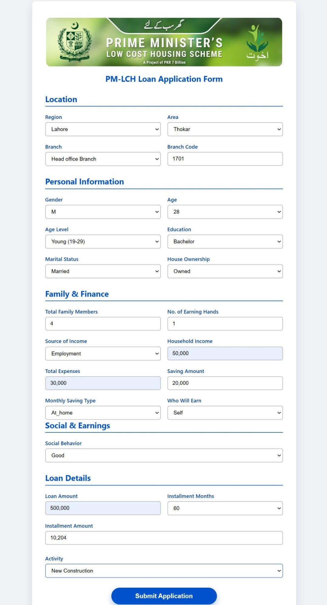

# 👋 Muhammad Asamullah Ulfat

**Data Analyst|Insight Generation|Statistical Modeling|Data-Driven Decision Making**  
📍 Working at Akhuwat Head Office | 🎓 BS in Information Technology (BSIT)

<!--Section 1: Introduce yourself-->
## ABOUT ME

Hello! I'm **Muhammad Asamullah Ulfat** 🤝, a passionate **Data Analyst** currently working at **Akhuwat Head Office** as an Associate Project Manager. With a BS in Information Technology (BSIT), I focus on turning raw data into meaningful insights that empower communities and support social impact initiatives. I specialize in data cleaning, visualization, dashboarding, and machine learning — and I'm always driven by the goal to make data useful, actionable, and transformative.
<!--Mention your top/relevant skills here - core and soft skills-->
## WHAT I DO
*As a data analyst at one of Pakistan’s leading social organizations, I apply data science for impact-driven decisions.*
**- ✅ Data Analysis & Predictive Modeling.**  
I build analytical solutions to forecast outcomes — from loan default predictions to savings pattern analysis using supervised ML models.
🔢 Perform data cleaning, transformation, and preprocessing using Python (Pandas, NumPy) and SQL

📊 Conduct exploratory data analysis (EDA) to uncover trends, correlations, and outliers

📈 Build predictive models using machine learning algorithms (CatBoost, Random Forest, Logistic Regression)

🎯 Implement classification models for real-world use cases like loan default or tax prediction

🧠 Apply feature engineering and selection techniques to improve model accuracy

🛠 Use tools like Scikit-learn, CatBoost, and XGBoost for supervised learning tasks

📉 Evaluate model performance using accuracy, confusion matrix, precision-recall, and AUC-ROC

🌐 Deploy models via Flask for real-time web-based prediction apps

📁 Work with structured data in Excel, CSV, and relational databases

📊 Create visualizations and dashboards in Power BI and Tableau to support decision-making

**- ✅ Dashboard Reporting & Visualization.**  
I design interactive dashboards in **Power BI** and **Tableau** to support strategic decisions at executive levels.

**- ✅ SQL Data Management.**  
I clean, query, and transform datasets from relational databases to prepare them for visual storytelling and insight generation.

---

<!--Section 2: List 3-4 key projects-->
## MY PORTFOLIO

*A snapshot of the real-world projects I’ve worked on:*

**📌 PM-LCH Loan Prediction System**  
  
A Flask-based ML app that predicts if an applicant has paid taxes — used to support ethical lending decisions at scale.  
[🔗 Read More](https://github.com/asamullahulfat/loan-prediction-app)

---

**📌 Community Savings Behavior Dashboard**  
  
Visualized saving patterns and demographics of borrowers using Power BI — helping optimize microloan distribution.  
[🔗 Read More](https://github.com/asamullahulfat/community-savings-eda)

---

**📌 Exploratory Analysis on Loan Applicants**  
  
Performed feature analysis on household income, expenses, and social behavior for tax classification using Python.  
[📄 Download the Full Report (PDF)](assets/PM_LCH_EDA_Report.pdf)

---

## CONTACT DETAILS

*Let’s connect and explore how data can drive change!*

<table>
  <tbody>
    <tr>
      <td>📧</td>
      <td><a href="mailto:asamullah.arshad@example.com">asamullah.arshad@example.com</a></td>
    </tr>
    <tr>
      <td>📍</td>
      <td>Lahore, Pakistan</td>
    </tr>
    <tr>
      <td>⬇️</td>
      <td><a href="assets/Profile_CV.pdf">Download My CV</a></td>
    </tr>
    <tr>
      <td>🌐</td>
      <td><a href="https://linkedin.com/in/asamullahulfat">Let’s Connect on LinkedIn</a></td>
    </tr>
    <tr>
      <td>📺</td>
      <td><a href="https://www.youtube.com/@DataWithUlfat">Watch My Tutorials on YouTube</a></td>
    </tr>
  </tbody>
</table>
